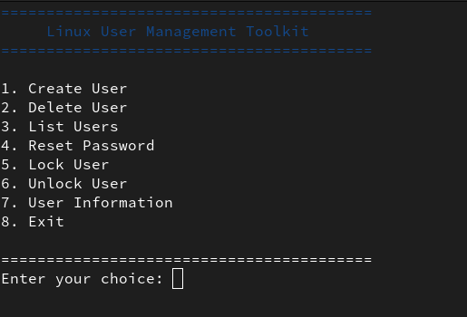
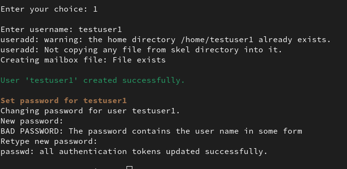
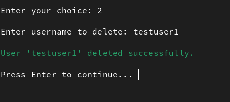
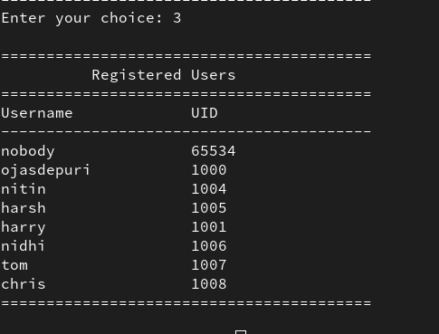
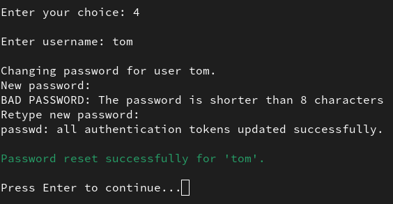
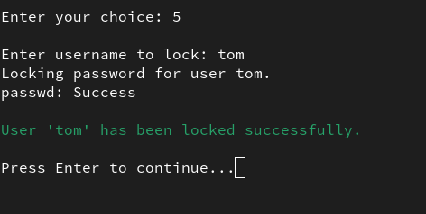
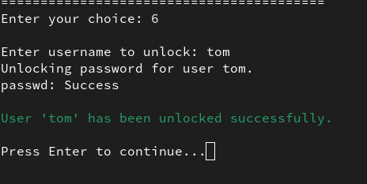
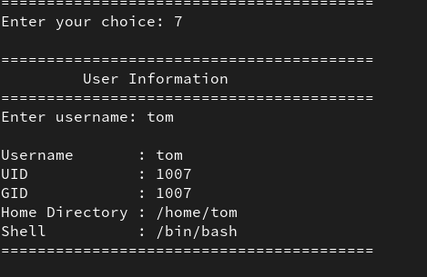

# 🐧 Linux User Management Toolkit

A menu-driven Bash scripting project that automates Linux user management tasks. This toolkit simplifies common administrative operations such as creating users, deleting users, resetting passwords, locking/unlocking user accounts, and viewing user information through an interactive command-line interface.

---

## 📌 Features

- Create new Linux users
- Delete existing Linux users
- List all regular users
- Reset user passwords
- Lock user accounts
- Unlock user accounts
- Display user information (UID, GID, Home Directory, Shell)
- Username input validation
- Activity logging with timestamps
- Colored terminal output
- Interactive menu-driven interface

---

## 🛠️ Technologies Used

- Bash Shell Scripting
- Linux (CentOS / RHEL)
- Git & GitHub
- Linux User Management Commands

---

## 📋 Prerequisites

- Linux operating system (CentOS/RHEL recommended)
- Bash shell
- Sudo privileges
---

## 🚀 Installation

1. Clone the repository:

```bash
git clone https://github.com/<ojasdepuri>/Linux-User-Management-Toolkit.git
```

2. Navigate to the project directory:

```bash
cd Linux-User-Management-Toolkit
```

3. Make the script executable:

```bash
chmod +x main.sh
```

4. Run the toolkit:

```bash
./main.sh
```

---

## ▶️ Usage

After launching the script, you will be presented with an interactive menu:

```text
1. Create User
2. Delete User
3. List Users
4. Reset Password
5. Lock User
6. Unlock User
7. User Information
8. Exit
```

Choose the desired option by entering its corresponding number.

---

## 📂 Project Structure

```
Linux-User-Management-Toolkit/
│
├── main.sh
├── README.md
├── Logs/
│   └── activity.log
└── LICENSE (optional)
```

---
---

## 📸 Screenshots

### Main Menu



### Create User



### Delete User



### List Users



### Reset Password



### Lock User



### Unlock User



### User Information


